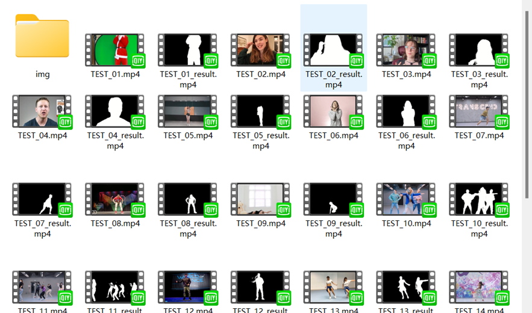
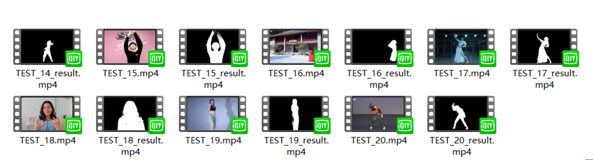

# RobustVideoMatting_onnxruntime
人像抠图--使用vs2019，onnxruntime框架进行部署

##### **完整项目对应的百度网盘下载（只需vs配置onnxruntime环境即可）**：链接：https://pan.baidu.com/s/1gqrZC6VF01lSZCnwG667IQ 提取码：l37e


#### 1.拉取项目

```
git clone https://github.com/caip1299920300/RobustVideoMatting_onnxruntime.git
```

#### 2.配置VS环境（下面是小弟写的一个博客，大家参考，随便点个赞👍）

[链接（点我）](https://blog.csdn.net/caip12999203000/article/details/125516627?csdn_share_tail=%7B%22type%22%3A%22blog%22%2C%22rType%22%3A%22article%22%2C%22rId%22%3A%22125516627%22%2C%22source%22%3A%22caip12999203000%22%7D&ctrtid=PvRe0)

#### 3.运行代码，结果图




